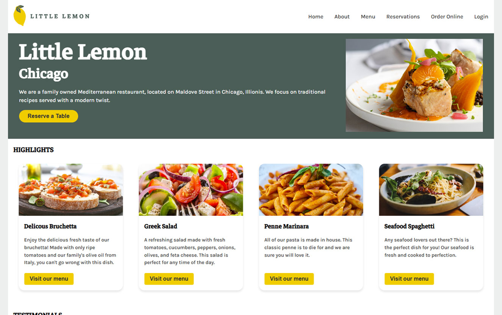
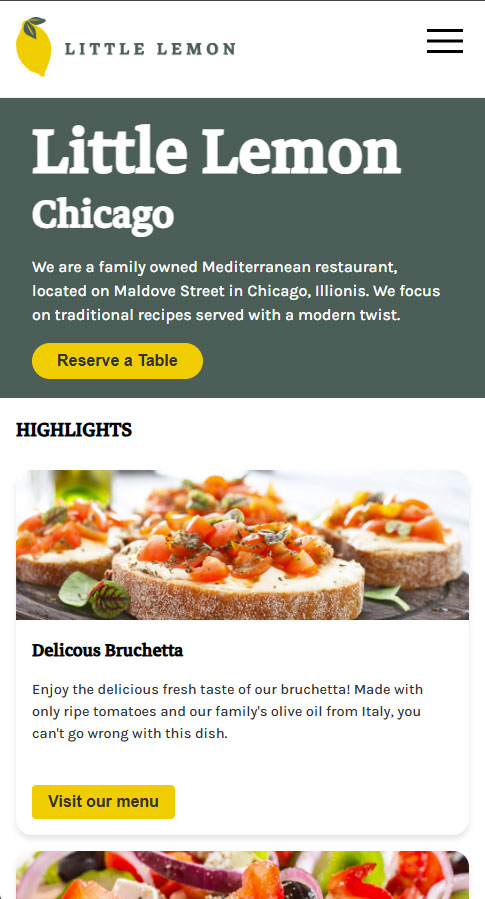

# Little Lemon Capstone Project

This is portfolio website example for the ficticious Little Lemon restaurant. The project took approximately a week to take from design concept, through wireframing, coding, developing tests for and adding accessibility elements. It has the following features:

- Built with React 19.1.0
- It has a fully responsive design
- Beautiful graphic elements and multiple pages through React Router
- Has an area where a login mechanism could be developed
- Features basic tests of the reservation system using the react testing library
- Showcases various techniques from styling, component composition and data manipulation.
- Plus more.

## Preview Images

To give you a better idea of how the site looks, you can check out our images below. 

    <h3>Full Screen</h3>
    

    <h3>Mobile</h3>
    

## Questions?

If you have any questions about this project that I can answer, please feel free to reach out and let me know. I am also currently interested in developing several projects for companies of all sizes. If interested, contact me and I can send over my work details.

